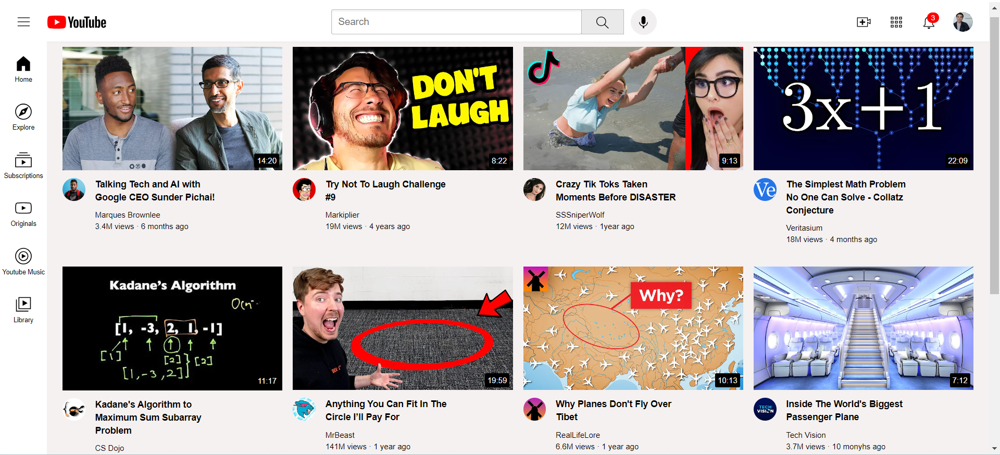

# Youtube Clone

## Description
The Youtube Clone project is a simple web page created to enhance front-end development skills. It emulates the appearance and basic functionality of the youtube using HTML, CSS.
## Technology Used
HTML,
CSS
## Deployment

To deploy this project run

```bash
  npm run deploy
```

To run this project locally:

1. Clone the repository to your local machine:
```bash
git clone https://github.com/Gaurav-bhardwaj7220/YouTube-Clone.git
```
2. Navigate to the project folder:
```bash
cd YouTube-Clone
```
3. Open the index.html file in your favorite code editor (e.g., Visual Studio Code).

4. You can preview the project by opening index.html in your web browser.
## Usage
The Youtube Clone project provides a basic interface that emulates the Youtube. Users can explore and interact with the UI to get a feel for the Youtube's appearance and layout.